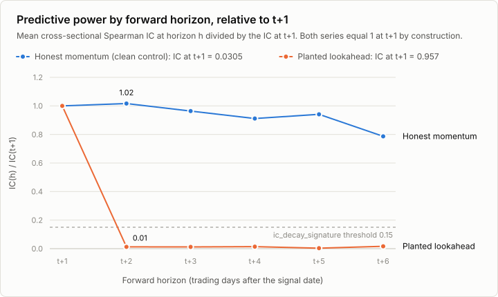

# Quantitative Backtest Validation & Bias Detection

`qaudit` is a Python library that audits equity backtests for lookahead bias, target leakage, train/test contamination, survivorship bias and cost-accounting errors. It takes the tables an existing backtest already produces (signals, returns, positions, net returns, universe, prices) and returns one result per check, with the measured evidence and a suggested fix.

Static checks inspect the supplied tables. Optional dynamic probes rerun the user's own signal and backtest functions with placebo signals, shuffled labels, date shifts and truncated histories. Reports can be saved as JSON, Markdown or a single offline HTML file.

**Author:** Chung Shing Mars Wong

## Run

Tested on Python 3.10 to 3.13. From the repository root:

```sh
python3 -m venv .venv
source .venv/bin/activate
python -m pip install -e .
python examples/first_audit.py
```

The [example](examples/first_audit.py), built on the simulated market in [synthetic.py](src/qaudit/synthetic.py), simulates 30 assets over 1,000 trading days, runs a momentum backtest with a one-day signal lag and declared costs, and audits it with all seven check families, including the dynamic probes. It prints the status counts and creates `results/first-audit/` with `report.json` and the six input tables as CSV files. It needs no market data and no network access. An existing output directory is rejected, so a second run needs `--output-dir results/second-audit` or another new path.

To run the tests, install the development extras with `python -m pip install -e '.[dev]'` and run `python -m pytest`. The full suite has about 1,900 tests and takes roughly ten minutes, most of it in the dynamic probes; `python -m pytest tests/test_qaudit_cli.py` runs a single file in a few seconds.

## How it works

The premise is that the usual ways a backtest goes wrong leave measurable statistical traces in the tables it exports. A signal that contains the next period's return predicts that return far better than any real signal can, and stops predicting at t+2. A book that trades on the bar it forecasts lines up with the undelayed signal. Net returns that were never charged costs equal the gross returns rebuilt from the positions. Each check measures one such trace and compares it with what an honest backtest of the same shape would produce.

### The demonstration backtest

The example, the demonstration and many of the tests share one simulated market and one pipeline, defined in [synthetic.py](src/qaudit/synthetic.py) and seeded so that every run is reproducible:

- **Market.** 30 assets over 1,000 business days from January 2018. Each asset has a beta between 0.7 and 1.3 to a common market factor (mean 0.02% and volatility 1% per day) and an idiosyncratic return with a daily volatility between 1.5% and 2.5%. The idiosyncratic return loads 0.15 on its own trailing 20-day mean, which plants a weak but genuine momentum effect. Four assets (15% of the panel, rounded down) delist at random dates between 40% and 90% of the sample; from then on their returns are missing and they are out of the point-in-time universe.
- **Signal.** Each asset's trailing 20-day mean return, z-scored across assets on each date. It uses data up to and including that date only.
- **Portfolio construction.** The weights held on day t come from the signal of day t-1. Assets are ranked on the signal, the ranks are demeaned and scaled to a gross exposure of 1, so the book is dollar-neutral with 50% long and 50% short. Assets without a signal are flat.
- **Execution and costs.** Day t's weights earn day t's returns. Costs are 10 bps per unit of value traded, and trades are measured against the holdings as they drifted with the previous day's returns rather than against the previous target weights; the first day pays for building the whole book. The backtest declares its cost, its one-day lag and a train/test split (the first 60% of dates for training, and a test window that starts five business days after training ends).

The honest pipeline earns a mean information coefficient of about 0.03 and an annualized net Sharpe ratio of about 1.8. It is the clean control, and it must not produce a failure. Each planted-defect case in the demonstration changes one ingredient: the signal (mixed with the next-period return, replaced by the target plus noise, blended with forward returns smeared over six bars, or z-scored with full-sample statistics), the execution (same-bar weights while a one-day lag is declared), the declarations (overlapping train and test windows; a fast three-day signal with no costs charged or declared), or the data (the 30 best performers of 60 assets that never delist; the best of 200 noise signals on a market without momentum).

### Risk controls

An audit is meant to sit in front of a deployment decision, so a report can be turned into a pass or fail. In Python, `report.gate(...)` raises on check errors and on failures of medium severity or higher (its `min_severity`), and also on warnings once a `warn_severity` is set; the command line applies the same gate through its exit code, blocking on any failure and on high-severity warnings. `require=` (`--require` on the command line) also blocks when a family the workflow depends on was skipped rather than judged. [Reading results](#reading-results) gives the gate's exact rules, and the command line's exit codes are listed under [Audit your own backtest](#audit-your-own-backtest). The report also discloses its own coverage, for example when the two required tables barely overlap.

### How the checks measure

- **Lookahead and leakage.** The core measurement is the per-date Spearman information coefficient (IC) between the signal and the forward return at horizons t+1, t+2 and later. An honest signal has a small IC that decays slowly across horizons; an embedded future return gives a very large IC at t+1 that vanishes at t+2, and a leak that skips the next bar shows as a deferred spike at a later horizon. Other lookahead checks compare positions with the signal at several lags and test position sizes against future volatility after controlling for trailing risk.
- **Significance.** Time series of ICs are judged with Newey-West t-statistics, so autocorrelated and overlapping-label dates do not overstate the evidence. Counts of near-perfect or outlying IC dates are compared with a rank-correlation null that is exact for the number of assets and the tied values on each date, and simulated or approximated when the cross-section is too wide to enumerate.
- **Performance.** The probabilistic Sharpe ratio allows for skewed and fat-tailed returns and for serial dependence. The deflated Sharpe ratio asks whether the observed Sharpe beats the best result that luck alone would produce across the declared number of trials.
- **Costs.** Gross returns are rebuilt from positions and asset returns, traded value is measured against the drifted holdings described above, and the cost per unit traded that the net returns imply is reconciled with the declaration. The turnover check asks whether the trading could be executed at all, and the cost-sensitivity check whether the edge survives plausible costs.
- **Survivorship.** Positions are checked against the point-in-time universe and against missing returns, where a delisting loss would silently count as zero. A universe that no asset ever leaves, or uniformly complete histories, point to survivor-only data.
- **Dynamic probes.** These rerun the user's own functions. The date-shift probe moves the signal a few bars earlier and later: an honest edge improves when it peeks earlier and decays gracefully with delay, while a leak collapses once the signal leaves the executed bar. Placebo signals that mimic the real signal's persistence (or, for sparse signals, its event pattern) go through the same pipeline; they should earn nothing beyond their market exposure on average, and the backtest is ranked against them. Shuffled-label nulls permute blocks of return dates and relabel assets, which destroys any real relationship. The truncation probe recomputes the signal on history cut at a tested date and requires the same value on that date.

## Audit your own backtest

Export the backtest's tables as CSV and pass them to the command line tool. Signals and asset returns are required; each further table enables more checks.

```sh
python -m qaudit \
  --signals results/first-audit/signals.csv \
  --asset-returns results/first-audit/asset_returns.csv \
  --output results/csv-audit.json
```

After installation, `qaudit` is equivalent to `python -m qaudit`. The command prints the findings and writes the full evidence as JSON; it never overwrites an existing output file. With only the two required tables many checks report `SKIP`, including four of the five cost checks, and `costs.no_cost_declaration` warns that no costs were declared. Add each optional table and declaration as another option on the same command, with a new `--output` path, for example `--positions results/first-audit/positions.csv --cost-bps 10`.

Each panel CSV has a `date` column followed by one column per asset:

```csv
date,AAA,BBB,CCC
2024-01-02,0.01,-0.005,0.002
2024-01-03,-0.003,0.008,0.001
```

Use ISO dates, unique and increasing, with the same asset names in every file. Leave missing cells blank; do not write zero for an unknown return. Returns are simple decimal returns (`0.01` is 1%). The strategy-returns file is the one exception to the panel layout: exactly two columns, `date,return`. The two required tables must share at least 30 dated rows. Most statistical checks need about 120 periods or more and several assets.

| Input | What each value means | Option |
|---|---|---|
| Signals (required) | Score known at the end of that date. | `--signals` |
| Asset returns (required) | Return of each asset over the period ending on that date. | `--asset-returns` |
| Positions | Portfolio weight held during that date; `0.1` is 10%. | `--positions` |
| Strategy returns | Net portfolio return for that date, after the costs actually charged. | `--strategy-returns` |
| Universe | Whether the asset was investable on that date, as known then; `1`/`0` or `true`/`false`. It must run to the last backtest date: a membership file that stops more than about two weeks early (on monthly data, even one month early) is rejected rather than read as delistings. Padding the gap with `false` does not help: exits on a bar where at least half the members leave at once are not counted as attrition. | `--universe` |
| Prices | Prices consistent with the return series and its adjustment convention. | `--prices` |

Timing convention: with the default one-period lag, the signal known at Monday's close may first affect the weights held during Tuesday, and Tuesday's weights earn Tuesday's asset returns. Remap exports that follow another convention before auditing them.

The remaining options declare what the backtest did, so that the audit can test it:

| Option | Meaning |
|---|---|
| `--cost-bps 10` | One-way cost actually charged, in basis points per unit traded. A declaration only; it does not deduct costs. |
| `--trials 50` | Total strategy configurations tried in this research, including discarded ones. Used by the deflated Sharpe check. |
| `--signal-lag 1` | Periods between a signal and the first position it may affect. Default 1. |
| `--label-horizon 1` | Periods spanned by the prediction target. Default 1. |
| `--periods-per-year 252` | Annualization factor. Default 252. |
| `--train-period START END`, `--test-period START END` | Inclusive training and test windows. The contamination checks need both. |
| `--require costs` | Require every check matching a family or check ID to have run. Repeatable. |

Exit codes: `0` no blocking finding among the checks that ran; `1` a failure, a high-severity warning, a check error, unmet `--require` coverage, or no judged check at all; `2` invalid input or an output error. CSV audits cannot run the dynamic probes, which need Python functions.

## Checks

| Family | What it looks for | Check IDs |
|---|---|---|
| `lookahead` | Signals or positions that use information earlier than the declared lag allows: misaligned execution, same-bar dependence, sizing on future volatility, and forward returns embedded in the signal. | `lookahead.position_signal_alignment`, `lookahead.same_bar_bleed`, `lookahead.future_vol_sizing`, `lookahead.embedded_future_return`, `lookahead.ic_decay_signature`, `lookahead.deferred_ic_spike`, `lookahead.smeared_forward_ic`, `lookahead.same_bar_return_loading` |
| `leakage` | The prediction target inside the signal: rank correlation with the forward return that is too high overall or on a subset of dates, and signals that are an affine copy of the target. | `leakage.target_correlation`, `leakage.perfect_rank_dates`, `leakage.signal_target_identity`, `leakage.ic_outlier_dates` |
| `contamination` | Declared train and test windows that overlap, lack an embargo of at least the label horizon, are out of order, or cover too little of the sample. | `contamination.split_declared`, `contamination.split_overlap`, `contamination.insufficient_embargo`, `contamination.test_before_train`, `contamination.split_coverage` |
| `survivorship` | Positions outside the point-in-time universe or on assets with missing returns, a universe that nothing ever leaves, and uniformly complete asset histories when no universe is supplied. | `survivorship.trading_outside_universe`, `survivorship.positions_on_missing_returns`, `survivorship.no_exits`, `survivorship.full_history_universe` |
| `performance` | Results that are implausible or fragile: extreme Sharpe or IC, a Sharpe that does not survive deflation for the number of trials, IC that is unstable or carried by one year, and short samples. | `performance.suspicious_sharpe`, `performance.deflated_sharpe`, `performance.suspicious_ic`, `performance.ic_stability`, `performance.ic_regime_concentration`, `performance.sample_size` |
| `costs` | Net returns that equal cost-free gross returns, missing or inconsistent cost declarations, turnover that could not be executed, an edge that disappears at plausible costs, and prices that disagree with returns. | `costs.missing_transaction_costs`, `costs.no_cost_declaration`, `costs.turnover_unrealistic`, `costs.cost_sensitivity`, `costs.price_return_consistency` |
| `dynamic` | Reruns of the user's functions: placebo signals and shuffled returns should show no edge, the edge should not collapse when the signal is seen one bar early (a leak signature) or vanish when it is delayed by one bar, and signals recomputed from the raw input, in full and on truncated history, should match the audited ones. | `dynamic.placebo_pipeline_bias`, `dynamic.placebo_percentile`, `dynamic.shuffled_labels`, `dynamic.date_shift`, `dynamic.signal_reproducibility`, `dynamic.rolling_window_integrity`, `dynamic.signal_input_sensitivity` |

A check that lacks an input reports `SKIP` and names what to pass. Without a declared train/test split the contamination family reports a single `SKIP`. Diagnostics about the audit itself can also appear: `audit.coverage` when the two required tables share only a small part of their dates or assets, or have too few assets per date (fewer than 30 dates with at least 5 jointly finite assets); `dynamic.probe_health` when a null distribution is unusable; and `audit.filter_matched_nothing`, `audit.filter_pattern_matched_nothing` (errors) or `audit.exclude_pattern_matched_nothing` (a warning) when an `include` or `exclude` pattern matches nothing. Thresholds are fields of `AuditConfig` in [config.py](src/qaudit/config.py).

## Reading results

| Status | Meaning |
|---|---|
| `PASS` | The check ran and did not find its modeled problem. |
| `WARN` | Evidence that needs investigation. |
| `FAIL` | Evidence crossed the check's failure threshold. |
| `SKIP` | The check could not run; the message names the missing input. |
| `ERROR` | A check or a supplied function raised an exception. |

Each result also carries a severity (`INFO`, `LOW`, `MEDIUM`, `HIGH` or `CRITICAL`), a message, the measured details and, for findings, a remediation.

The summary line says `CLEAN` when nothing failed or errored and `SUSPECT` otherwise. `CLEAN`, like `report.ok`, is advisory: warnings and skips do not change it, so a report in which every check was skipped is still `CLEAN`. Automated acceptance should use the gate instead, on the `report` returned by `audit` (next section); the command line applies it through its exit code and `--require`:

```python
from qaudit import Severity

report.gate(require=["lookahead", "leakage", "costs"], warn_severity=Severity.HIGH)
```

`gate` raises `AuditFailure` on any `ERROR`, on a `FAIL` of severity `MEDIUM` or higher (`min_severity`), on a `WARN` at or above `warn_severity`, and when a required pattern matches nothing or matches a check that was skipped, not judged or left unresolved. `allow_partial=True` accepts a family in which at least one check was judged. A passing gate means the required checks ran and none produced a blocking result. A `WARN` below `warn_severity` (any `WARN` when `warn_severity` is not given) and a `FAIL` below `min_severity` still pass.

## Python API and dynamic probes

```python
import pandas as pd
from qaudit import BacktestArtifacts, audit

signals = pd.read_csv("results/first-audit/signals.csv", index_col="date", parse_dates=True)
asset_returns = pd.read_csv("results/first-audit/asset_returns.csv", index_col="date", parse_dates=True)

report = audit(BacktestArtifacts(signals=signals, asset_returns=asset_returns))
print(report)
```

`BacktestArtifacts` takes date-indexed DataFrames with one column per asset (`signals`, `asset_returns` and, optionally, `positions`, `universe`, `prices`), a Series of net `strategy_returns`, and the declarations `signal_lag`, `label_horizon`, `declared_costs_bps`, `periods_per_year`, `train_period` and `test_period`. `audit` also accepts an `AuditConfig` (thresholds, seed, `n_trials`) and `include=[...]` or `exclude=[...]` to select families or check IDs. Results are available as `report.results`, `report.failures`, `report.warnings`, `report.skips`, `report.find("costs")` and `report["costs.cost_sensitivity"]`.

The dynamic probes run when the pipeline itself is supplied:

```python
report = audit(
    BacktestArtifacts(signals=signals, asset_returns=asset_returns,
                      positions=positions, strategy_returns=net_returns,
                      signal_input=raw_data, declared_costs_bps=10),
    signal_func=build_signals,
    backtest_func=run_backtest,
)
```

- `signal_func(raw_data) -> signals` rebuilds the signal panel from `signal_input`, including any preprocessing. The row for date t may use input rows up to t only; the truncation probe tests exactly this.
- `backtest_func(signals, asset_returns) -> net_returns` reruns the portfolio logic with the real execution lag and costs. It returns a Series of net returns on the supplied dates, with at least 30 finite values and no gaps inside its span, cash periods included.

Both functions must compute from their arguments. Cached results, hidden full-history data, or constants fitted on the full sample outside `signal_func` defeat the probes. With the default `AuditConfig` the probes call `backtest_func` about 300 times (`n_placebo` and `n_shuffle` are 100 each), so the backtest's own speed sets the runtime.

`report.to_dict()` returns a JSON-serializable dict; `report.to_markdown()` and `report.to_html()` return strings, the HTML being a single offline file. The JSON keeps every measurement and remediation together with the provenance of the run: configuration, package versions and SHA-256 fingerprints of the inputs and of the library source.

## Demonstration

```sh
qaudit-demo --summary-only --output-dir demo-output
```

`qaudit-demo` audits ten synthetic backtests: a clean control and nine with one planted defect each (next-period returns mixed into the signal, same-bar execution, a signal that is the target plus noise, full-sample z-scoring, overlapping train and test windows, a survivor-only universe, zero costs, the best of 200 noise signals, and a forward-return leak smeared over several bars). A full run takes about a minute on a laptop, prints its progress to standard error and ends with this summary (the time and paths vary):

```text
==============================================================================
summary (60s total)
case                    caught/expected  demo status
------------------------------------------------------------------------------
clean                               0/0  CLEAN
lookahead                           3/3  FLAGGED
same_bar_execution                  1/1  FLAGGED
target_leak                         2/2  FLAGGED
rolling_window_leak                 1/1  FLAGGED
contaminated_split                  1/1  FLAGGED
survivorship                        1/1  FLAGGED
no_costs                            1/1  FLAGGED
overfit                             1/1  FLAGGED
smeared_leak                        2/2  FLAGGED
clean false-positive guard: OK (37 PASS, 0 WARN, 2 SKIP)
HTML report: /path/to/demo-output/index.html
JSON evidence: /path/to/demo-output/reports.json
```

"Expected" counts the check IDs or families each case is built to trigger, and "caught" counts those in which a check reported `WARN` or `FAIL`. The fractions describe these ten constructed cases; they are not a detection rate on real backtests. The command exits nonzero if a planted defect is missed, the clean control fails, or a check errors. `demo-output/index.html` is a single offline file holding every finding with its measured evidence and provenance, and `demo-output/reports.json` holds the same evidence as JSON. An existing output directory is rejected.

### Sample output

`qaudit-demo lookahead` audits one case and prints one line per check, with the measured evidence and a suggested fix. An excerpt, with long lines cut at `...`:

```text
qaudit: SUSPECT - 39 checks (9 FAIL, 2 WARN, 23 PASS, 5 SKIP)
  sample: 1000 periods x 30 assets
  [FAIL |critical] lookahead.embedded_future_return - signal contains the next-period return: mean |per-date Spearman IC| vs the h=1 forward return = 0.957 over 980 dates (threshold 0.60; ...)
          fix: Remove the label window from the feature computation: every input to signals.loc[t] must be observable by the close of period t. ...
  [FAIL |critical] leakage.perfect_rank_dates - 975 of 980 dates rank the future return almost perfectly (|IC| >= 0.90), e.g. 2018-01-29, 2018-01-30, 2018-01-31 - the count exceeds the noise bound 3.0; the target is inside the signal
  [FAIL |critical] dynamic.date_shift - peeking one bar EARLIER destroys the strategy (annualized SR 76.2 -> 0.3 at shift k=-1, remnant below 25% of baseline; ...)
  [FAIL |high] performance.suspicious_sharpe - ann SR 76.2 (net strategy_returns) for a 252-periods/year equity alpha is not an edge, it is a bug - ...
  [WARN |high] lookahead.ic_decay_signature - predictive information lives entirely in the next bar and vanishes at t+2 (mean IC(h=1) = 0.957, IC at t+2 = 0.012, ratio 0.012 < 0.15) - ...
  [PASS |critical] lookahead.position_signal_alignment - positions align best with the signal at lag 1 (declared lag 1); ...
```

[examples/sample-output/](examples/sample-output/) keeps one run of [make_sample_output.py](examples/make_sample_output.py): the complete JSON report for this case ([lookahead-report.json](examples/sample-output/lookahead-report.json)) and the chart below with its values ([ic-by-horizon.csv](examples/sample-output/ic-by-horizon.csv)). The chart shows the information coefficient (the mean cross-sectional Spearman correlation between the signal and the forward return) at horizons t+1 to t+6, divided by its value at t+1. The honest momentum signal of the clean control has a small IC of about 0.03 that decays slowly, as a persistent alpha does. The planted leak has an IC of 0.96 at t+1 and almost none from t+2 on, the pattern `lookahead.ic_decay_signature` flags. A test regenerates the sample and fails if its verdicts or plotted values drift.



## Scope and limits

This is research software for daily cross-sectional equity backtests. Other markets, frequencies and single-asset systems may need different detectors or calibration. The tests pair deliberately defective synthetic backtests with clean controls; they establish behavior on those cases only and do not estimate detection accuracy on real data. Detectors have false positives and blind spots, and a finding is evidence to investigate, not a verdict. An audit cannot prove that data was available at each historical date, that delisted assets are all present, that simulated fills match live execution, or that a strategy will be profitable. The library audits an existing backtest. It does not provide market data, a strategy engine or trade execution.

## Source

```text
src/qaudit/
  checks/         Static check families, one module each
  dynamic/        Probes that rerun the pipeline: placebo, shuffle, date shift, truncation
  inputs.py       BacktestArtifacts: input validation, alignment and the timing convention
  config.py       AuditConfig: thresholds, seed and probe counts
  api.py          audit(): check dispatch, filters, coverage advisory and provenance
  report.py       AuditReport: selectors, gate, JSON, Markdown and HTML output
  cli.py          CSV command line (qaudit)
  demo.py         Synthetic demonstration (qaudit-demo)
  synthetic.py    Simulated market, momentum signal, lagged rank portfolio, cost model
                  and the planted-defect cases used by the example, demo and tests
tests/            Defect and clean-control tests for each check, input contracts, CLI
examples/         first_audit.py, the complete local example; make_sample_output.py
                  and the committed sample-output/ it produced
```

Released under the [MIT License](LICENSE).
